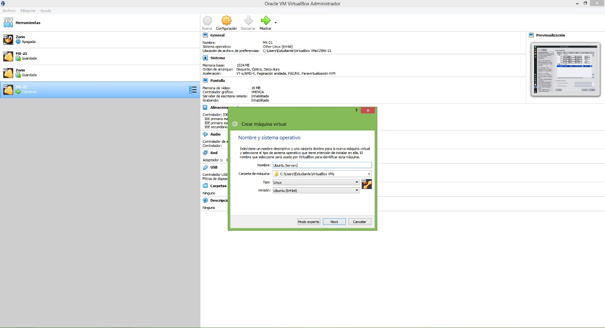
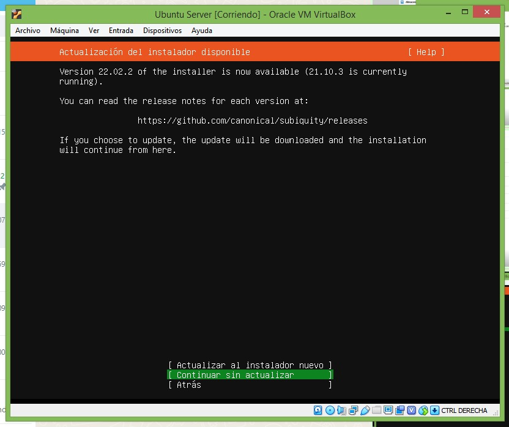
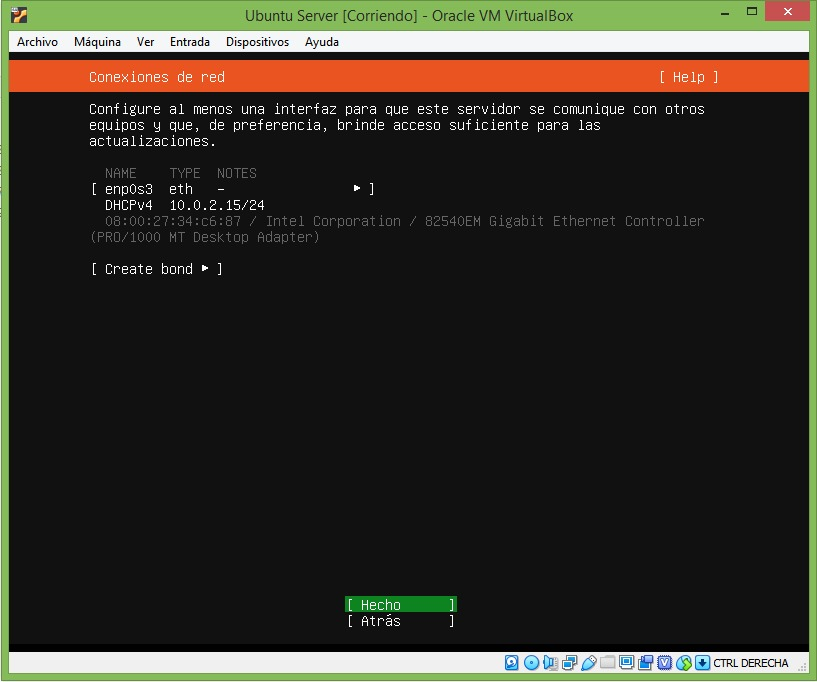
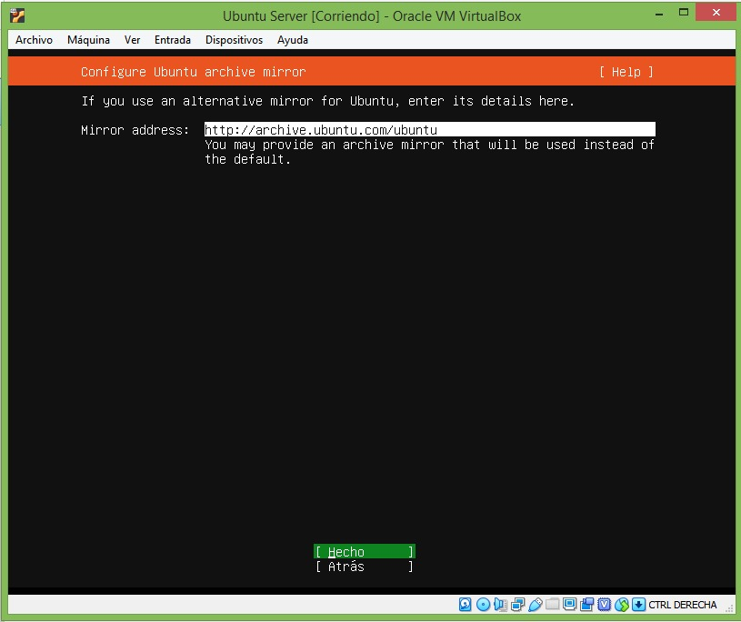
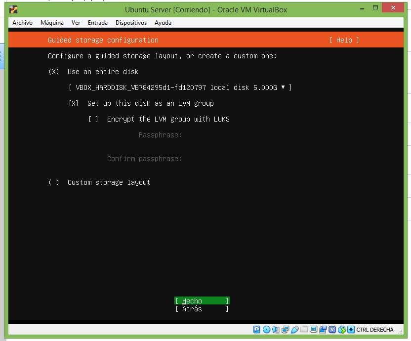
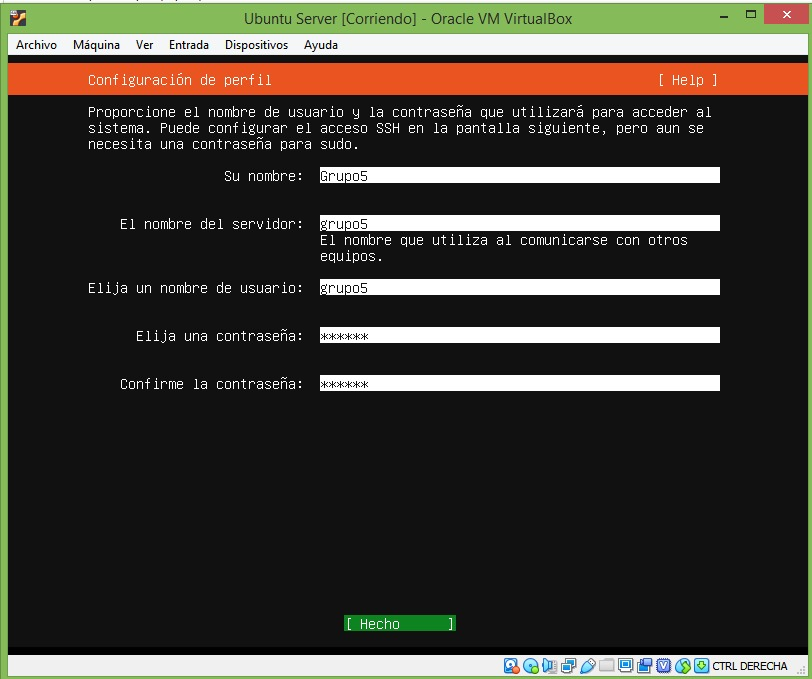
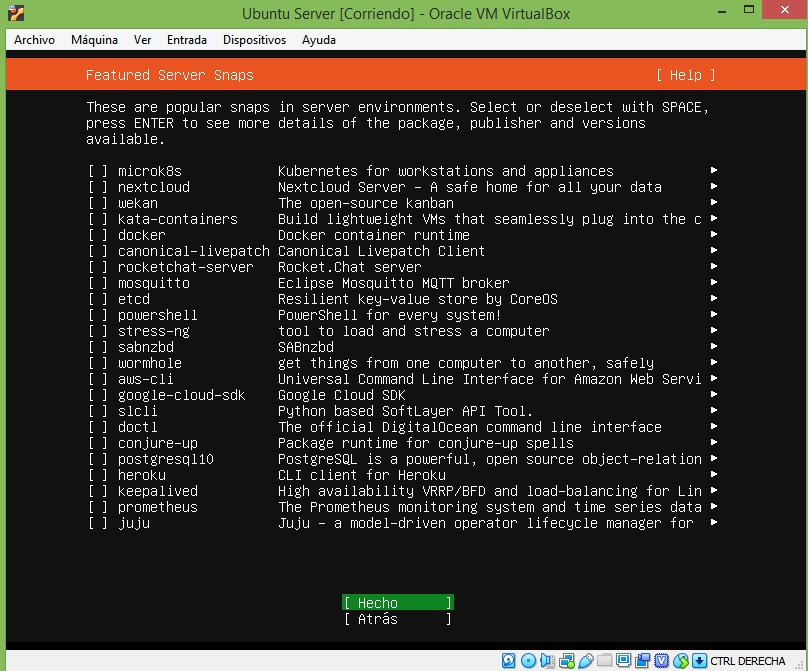
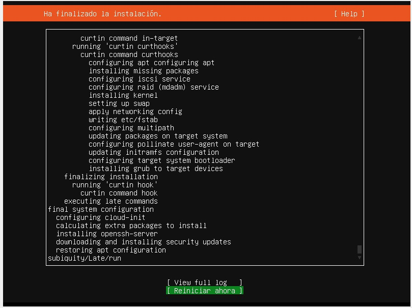

# UbuntuServer
grupo5
            paso 1: elegir el lenguaje con el que vamos a instalar ubuntu server
 

            paso 2: En este paso elegimos la configuracion del teclado se eligio el español 

            paso 3: elegimos el tipo de red en el cual trabajaremos

            paso 4: Más adelante nos pedirá donde vamos a descargar las actualizaciones instaladores y demás, nosotros lo dejamos por defecto y continuamos con la instalación:

            paso 5: Ahora viene una de las mejoras descritas por ubuntu en ubuntu server 20.04 y es la gestión del disco que es más rápida y segura.

            paso 6: luego debemos definir para registrar lo siguiente
             Your name: nombre descriptivo del usuario
             Your server’s name: nombre de la máquina
             Pick a username: nombre del usuario
             Choose a passowrd: password que nos va a valer como usuario root del sistema

            paso 7:Ahora, dentro de las mejoras de ubuntu 20.04, incluye los últimos paquetes de instalación más populares, entre los que cabe destacar: microk8s, dockers, mosquitto, postgrasql10, etc.

            paso 8:Una vez terminada la instalación como vemos se instala el sistema operativo de una manera muy rápida y nos pedirá reiniciar presentando un resumen de la instalación, nos dará la opción de ver el log completo de la instalación             

